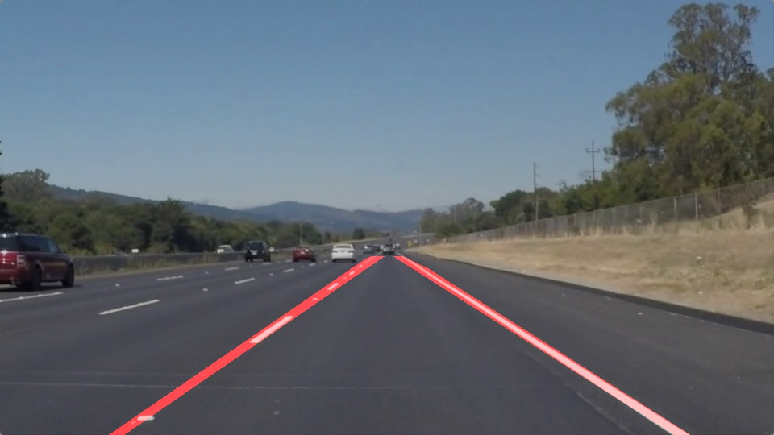

# **Finding Lane Lines on the Road** 

---

A project to find lane lines within a video of a car driving.

[//]: # (Image References)

---

## Project Reflections

### Image processing pipline

In order to process an entire video we build a pipeline to pass each frame through.

#### My pipeline consisted of 7 steps:

 1. Convert the image to grayscale.
    * Neccessary for step 3.
    * 
 2. Perform a [Gaussian blur](https://en.wikipedia.org/wiki/Gaussian_blur)
    * Removes some noise for better results in step 3
    * 
 3. Perform a [Canny edge detection](https://en.wikipedia.org/wiki/Canny_edge_detector)
    * Finds high gradients pixels which works ok to identify the outline of lane markers
    * 
 4. Mask away the image background.
    * This helps prevents other high gradient pixels outside of a defined zone of interest from affecting further steps. (e.g. other lane markers)
    * 
 5. Use a [Hough Lines Transform](https://en.wikipedia.org/wiki/Hough_transform) to detect lanes markers.
    * This finds lines of the lane markers by looking for sets of pixels that share a common line.
    * 
 6. Merge lane markers into a single line for each lane, and draw the lanes.
    * I do this with the following steps:
      1. Use a histogram to seperate each lane based on slope of the hough lines.
      2. Polyfit the points of those lines to determine the slope and bias of a line that passes through the lane.
      3. Draw the lines masked to the area of interest.
    * 
 7. Overlay the resulting image on the original frame.
    * 

### Running video through pipeline

Here is an example result running the pipeline over each frame of a video.

### Shortcomings

I really hope no one uses this in an actual self-driving car. It's really bad ;).

It's very quick to find almost anything a lane line even the shadow of a tree. It also makes no attempt at mapping the curves in the lane lines.

I can only imaine the anarchy that would insue if an actual self-driving car was on the road with this code.

### Possible improvements

This same pipeline with a few tweaks could provide far better and maybe even acceptable performance.

The largest room for improvement is probably better identifying which hough lines are actually apart of lane markers. You could do this by attempting to remove the noise by tweaking the parameters for Canny Edge Detection and the Hough Lines Transform, or by dropping lines with horizontal slope.

Another improvement could be to fit a 2nd degree line to the hough lines allowing for lane curves to be drawn.

But I expect that this is just not the best route to take for this task. A solution that I'd imagine more effective would be to gether a large dataset, and use machine learning to identify lane lines.